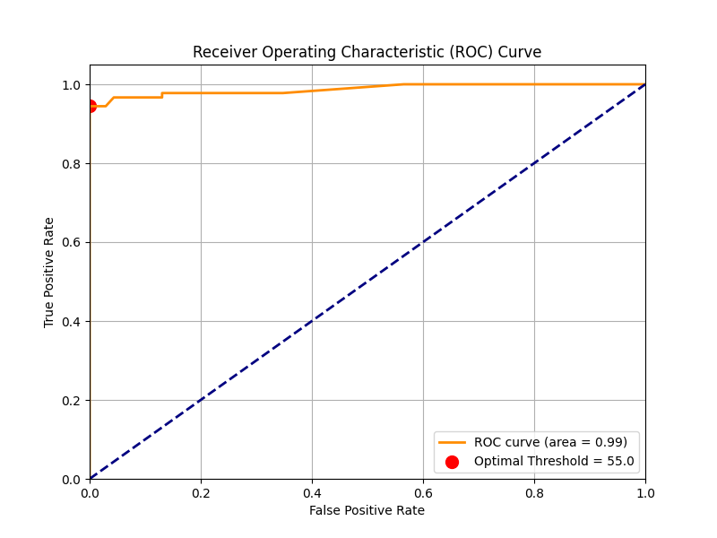
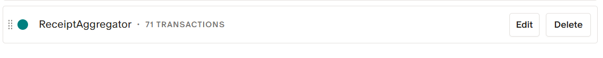
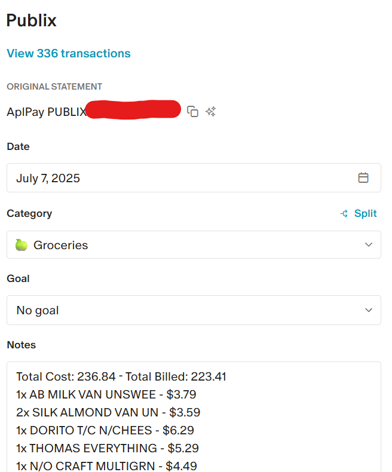

# Automated Receipt Processing
This document outlines a project to automatically parse email receipts, extract itemized data, and match it with financial transaction records.

## Step Zero: Data

I got a bunch of data from my email simply by downloading emails with the word 'order' or 'receipt' in them by using thunderbird. Most are pruned by the rule extractor, then some are pruned based on their age.

I had about 3000 emails that were caught by that filter, only 500 of them were actually receipts, and only about 80 of those were actually receipts.

Originally, I got my transactions exported as a csv from Monarch Money. Now, I use the unofficial Monarch Money API.

## Step 1: Loading and Pre-processing
Option A) The built-in Python email library: This approach avoids external dependencies but is noticeably slower.

Option B) fast_mail_parser: A Rust-based library that requires Cargo for installation. As expected, it offers a significant speed improvement.

For this proof-of-concept, I opted for the simpler, dependency-free Option A.

After loading, I pre-processed the email content by stripping out unnecessary elements like HTML tags, links, and excessive whitespace. This cleanup step reduces noise and simplifies the data for the subsequent processing stages.

## Step Two: Classification
Option A) LLM classification: This is the easiest route, but it is also a slower or potentially more costly route (depending if you do local or cloud). A LLM can simply read the email and return RECEIPT or NOT RECEIPT

Option B) A finetuned Bert: This is probably the most robust route, it would be faster than a LLM, but it takes a lot of training data, which I felt was not a needed step for this project as it is just a portfolio project.

Option C) Rule based classification: By assigning rules and scores, we can easily and quickly determine what is the a receipt and what isn't. I used a roc_curve to determine the best threshold.

I started by doing LLM classification on all of the emails using Gemini 2.5 Flash. This was fast and extremely accurate as it is a trivial task for a powerful model, and I could use the free version of ai studio.
Then, I set up rules based on my intuitions, such as if the subject contains 'receipt', that's a positive, if it contains 'shipped' that's a negative.
Then I used a roc_curve to determine the best threshold based on the 'truth' data from gemini 2.5 flash and the score data from the rule based classifier

I did not do it for this project, but it would make sense to add some more concrete rules for things that you know are receipts and are common. Such as specific email addresses or taglines in emails such as 'powered by toast'

I was able to add a few new rules and I got my roc curve to .99. This means this model is really accurate (for my testing data), I would want a much bigger dataset to know for sure.

## Step Three: Extracting the data
In my eyes, a LLM makes sense to solve this part of the problem as receipts can come in so many formats, training any kind of model or fuzzy matcher would be pretty difficult(but possible just very time consuming). However, this step takes a little bit longer since we are using a LLM. That's why we only are doing it AFTER we determine what is or isn't a receipt.

I wanted to use a local model for this part, as it is reoccurring, so it would make sense to limit the cost associated. I have been using mistral:7b due to its balance of speed and size and it runs well on my computer. But something like Qwen3-30B A3B runs decently and gives much better results. On better hardware, I would definitely use that model instead.

There are a few things we want:
1) The Total bill amount
2) The Charged amount: Since a user could use discount codes or gift cards, it is important to note the actual cost that would show up on a statement so that we can do some matching later.
3) Every item on the receipt
    - Its cost
    - Its name
    - Its description
4) The payment method is a nice little bonus to help further verify we have the correct item. However, it Gemma 3:4b is not quite capable enough to do it.

## Step four: Matching the data

Now that we have a list of items, and their itemized breakdown, we can make our csv report much more helpful.

We use the Monarch API to search for transactions within our date range and with a matching bill amount.

Then, we do a fuzzy match on the merchant via jaro_distance. If all of these things match, we are good to go!

Now we call the api and update the Notes and the tags!

## Improvements

- Do an initial search to get all transactions within +- 5 days from the date on the email, then do a fuzzy match of all of those options. If there is no similar transaction, we don't need to waste time using the LLM.
- Using a more powerful extractor LLM would make a lot of sense. Potentially trying with something like gemini 2.5 flash as a baseline first and then moving down in power.
- Skip or figure out how to parse dates for forwarded emails. That was the case for a lot of my receipts, as I forwarded them to someone else.
- Improve rule classifier to have explicit 'we know this is always a receipt' rules (i.e. specific email addresses from some big chains.)
- Handle multiple close matches - i.e. you make two purchases of $5 at the same location within 5 days of eachother. This could be handled by picking whichever date is closer
- Handle no matches - When we get no matches from the csv, we should drop the date search for the amount, and then do a series of steps to see if it is possibly the correct match (i.e. a LLM message or higher thresholds for string matches, or a month long window etc.) Things like hotels would currently fail, as you will get the receipt sometimes months before you actually get charged.
- Use the payment method(gemma:4b did poorly at extracting this) to further determine if it is the right transaction. i.e. if the bill is for $100 at the same merchant on the same day, but it is under your mastercard instead of your visa, that is likely the wrong transaction, they just happen to match.
- Handle receipts that are images or pdfs.